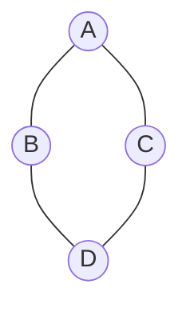
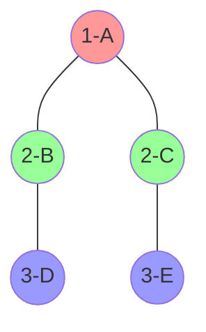

# 1. Teoria

## 1.1 O que vamos aprender?
Imagine que você está explorando uma cidade desconhecida. Você começa por um ponto central e visita todos os lugares próximos antes de se aventurar mais longe. É assim que funciona a **Busca em Largura (BFS - Breadth-First Search)**, uma técnica que nos ajuda a explorar **grafos** de forma eficiente.

A BFS se diferencia do **algoritmo de Dijkstra**: enquanto a BFS é ideal para encontrar o menor número de passos ou ligações entre dois pontos (quando todas as arestas têm o mesmo peso), o algoritmo de Dijkstra se destaca em encontrar o menor caminho em grafos onde as arestas possuem pesos diferentes.

Neste tutorial, você vai aprender:
- O que são **grafos**
- Como usar a **Busca em Largura** para navegar por eles

## 1.2 Por que isso é importante?
- **Grafos estão por toda parte**: redes sociais, mapas de GPS, conexões na internet.
- Eles são essenciais para resolver problemas **complexos** de forma simples.
- A BFS é uma das ferramentas mais **poderosas** para explorar grafos de maneira organizada.

---

# 2. Entendendo Grafos

## 2.1 O que é um grafo?
Um **grafo** é como uma rede de conexões, com **pontos** (vértices) ligados por **linhas** (arestas). Eles podem representar qualquer estrutura conectada!



### Componentes:
- **Vértices**: Os pontos (ex.: pessoas, cidades)
- **Arestas**: As conexões entre os pontos (ex.: amizades, ruas)

---

## 2.2 Exemplos práticos
- **Redes Sociais**: Quem está conectado com quem?
  Vértices = Pessoas 
  Arestas = Amizades
  
- **Mapa de Cidade**: Qual o menor caminho entre dois lugares?
  Vértices = Locais
  Arestas = Ruas  

---

# 3. Busca em Largura (BFS)

## 3.1 O que é a BFS?
A **Busca em Largura** funciona como ondas: começa em um ponto e se espalha de forma uniforme, alcançando primeiro os mais próximos e depois os mais distantes.

---

## 3.2 Como funciona?
1. Escolha um ponto de partida (ex.: A).
2. Visite todos os vizinhos diretos (ex.: B e C).
3. Em seguida, visite os vizinhos dos vizinhos.
4. Continue até que todos os pontos tenham sido explorados.

---

## 3.3 Visualizando a BFS
Aqui está a ordem em que os nós são visitados:


---

# 4. Utilidades práticas

## 4.1 Em mapas (GPS)
- Encontrar o caminho mais curto.
- Calcular rotas alternativas.
- Descobrir quanto tempo leva para chegar a um lugar.

## 4.2 Em redes sociais
- Sugerir amigos em comum.
- Descobrir quem está mais próximo de você (graus de separação).

## 4.3 Em jogos
- Encontrar rotas no mapa.
- Explorar labirintos.
- Criar inteligências artificiais para tomadas de decisão.

---

# 5. Como aplicar?

## 5.1 Código básico em Python
Aqui está como implementar a BFS:
```python
from collections import deque

def bfs(grafo, inicio):
    visitados = set()        # Conjunto para armazenar os visitados
    fila = deque([inicio])   # Fila para gerenciar a ordem de visitação
    visitados.add(inicio)    # Marca o ponto inicial como visitado

    while fila:              # Enquanto houver pontos para visitar
        atual = fila.popleft()  # Remove o próximo da fila
        print(f"Visitando: {atual}")

        for vizinho in grafo[atual]:  # Para cada vizinho do ponto atual
            if vizinho not in visitados:  # Se ainda não foi visitado
                visitados.add(vizinho)    # Marca como visitado
                fila.append(vizinho)     # Adiciona à fila
```

---

## 5.2 Exemplo prático
```python
# Grafo simples
grafo = {
    'A': ['B', 'C'],
    'B': ['A', 'D'],
    'C': ['A', 'D'],
    'D': ['B', 'C']
}

# Executando a BFS
bfs(grafo, 'A')
```

Saída esperada:
```
Visitando: A
Visitando: B
Visitando: C
Visitando: D
```

---

# 6. Dicas importantes

## 6.1 Para não esquecer
- **Marque sempre os pontos visitados** para evitar ciclos infinitos.
- Use uma **fila** para garantir a ordem de exploração.
- Experimente com exemplos simples antes de avançar.

---

## 6.2 Evite erros comuns
- Esquecer de registrar os pontos visitados.
- Visitar os pontos fora de ordem.
- Não tratar casos onde o grafo está desconectado.