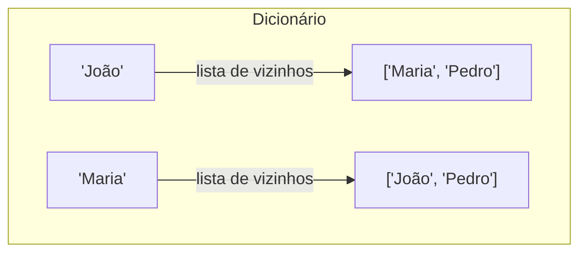
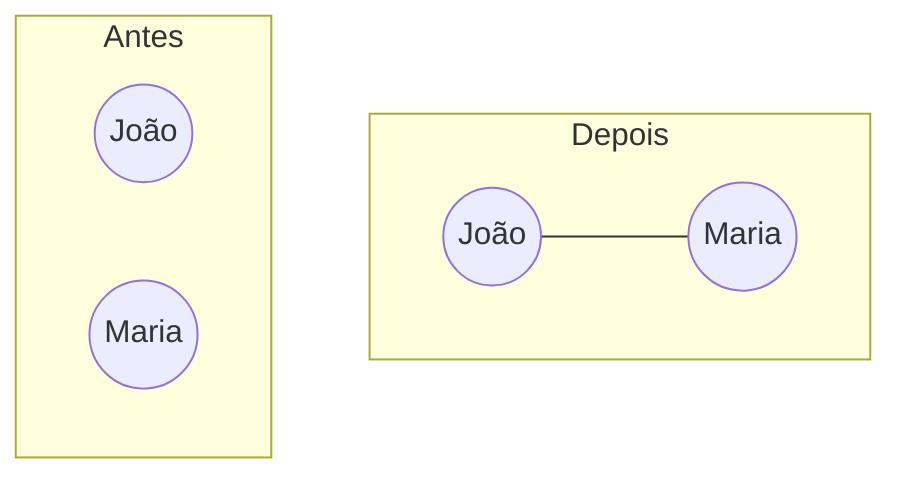
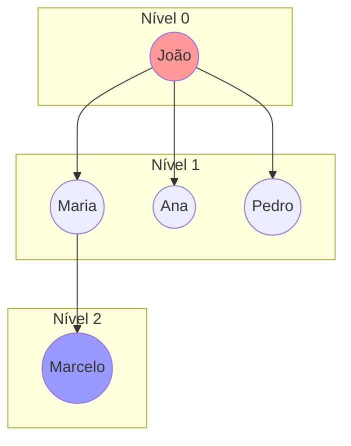
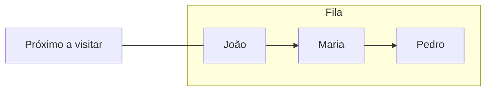
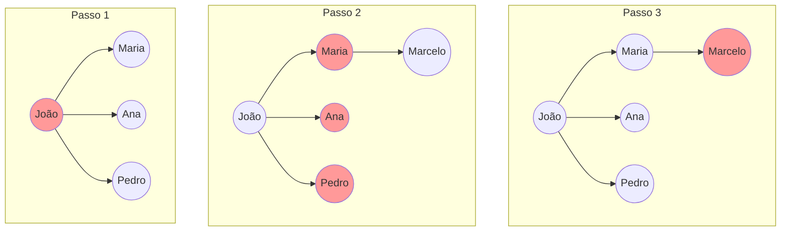
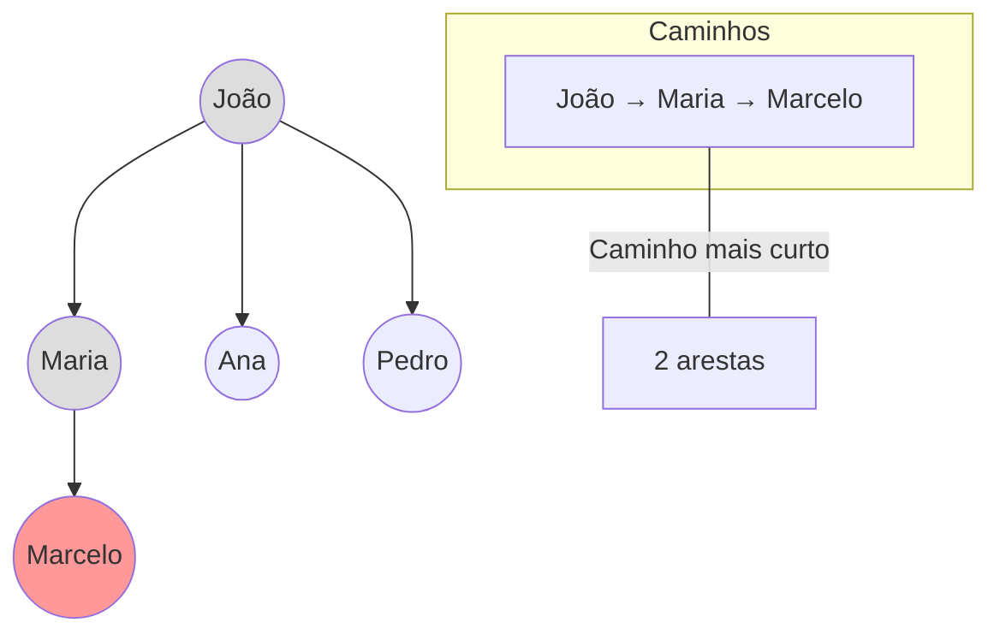

---
tags:
  - EntendendoAlgoritmos
---
---
# 1. Praticando

## 1.1 Projeto Sugerido

Crie um programa que:
1. Permita adicionar pessoas e amizades.
2. Encontre o caminho mais curto entre duas pessoas.
3. Mostre todas as conexões até um certo nível.

---

## 1.2 Código Base

```python
from collections import deque
from typing import Dict, List, Set, Optional
import time

class GrafoSimples:
    def __init__(self):
        # Inicializa o grafo diretamente com as pessoas e suas conexões
        self.grafo: Dict[str, List[str]] = {
            'João': ['Maria', 'Ana', 'Pedro'],
            'Maria': ['João', 'Marcelo'],
            'Marcelo': ['Maria'],
            'Pedro': ['Ana', 'João'],
            'Ana': ['Pedro', 'João']
        }
    
    def mostrar_grafo(self) -> None:
        """Mostra a estrutura atual do grafo"""
        print("\nEstrutura do Grafo:")
        print("------------------")
        for vertice, vizinhos in self.grafo.items():
            print(f"{vertice} -> {', '.join(vizinhos)}")
        print("------------------\n")

    def bfs(self, inicio: str) -> None:
        """Realiza uma busca em largura a partir de um vértice inicial"""
        if inicio not in self.grafo:
            print(f"Erro: Vértice '{inicio}' não existe no grafo!")
            return

        visitados: Set[str] = set()
        fila = deque([inicio])
        visitados.add(inicio)
        
        print("\nIniciando BFS...")
        print("---------------")
        nivel = 0
        nivel_atual = 1
        proximo_nivel = 0

        while fila:
            vertice = fila.popleft()
            print(f"Nível {nivel} - Visitando: {vertice}")
            nivel_atual -= 1
            
            time.sleep(0.5)  # Delay para visualização
            
            for vizinho in self.grafo[vertice]:
                if vizinho not in visitados:
                    visitados.add(vizinho)
                    fila.append(vizinho)
                    proximo_nivel += 1

            if nivel_atual == 0:
                nivel += 1
                nivel_atual = proximo_nivel
                proximo_nivel = 0
                print("---------------")

        print("BFS concluída!")

    def encontrar_caminho(self, inicio: str, fim: str) -> Optional[List[str]]:
        """Encontra o caminho mais curto entre dois vértices"""
        if inicio not in self.grafo or fim not in self.grafo:
            print("Erro: Vértice de início ou fim não existe no grafo!")
            return None
        
        visitados = set()
        fila = deque([(inicio, [inicio])])
        visitados.add(inicio)

        print(f"\nBuscando caminho de '{inicio}' até '{fim}'...")
        while fila:
            vertice, caminho = fila.popleft()

            if vertice == fim:
                print(f"Caminho encontrado: {' -> '.join(caminho)}")
                return caminho

            for vizinho in self.grafo[vertice]:
                if vizinho not in visitados:
                    visitados.add(vizinho)
                    novo_caminho = caminho + [vizinho]
                    fila.append((vizinho, novo_caminho))

            time.sleep(0.3)  # Delay para visualização
        
        print("Nenhum caminho encontrado!")
        return None

# Execução direta do código
if __name__ == "__main__":
    # Cria o grafo e executa as buscas
    rede = GrafoSimples()
    
    # Mostra a estrutura do grafo
    rede.mostrar_grafo()
    
    # Explora conexões a partir de João
    print("\nExplorando conexões a partir de João:")
    rede.bfs('João')
    
    # Encontra caminho entre João e Marcelo
    rede.encontrar_caminho('João', 'Marcelo')
```

---

# 2. Estrutura Básica do Grafo

## 2.1 Representação do Grafo
No nosso código, usamos um **dicionário** para representar o grafo:

```python
self.grafo: Dict[str, List[str]] = {}
```

Isso cria uma estrutura de dados onde:
- Cada chave é um **vértice** (uma pessoa, por exemplo).
- O valor associado a cada chave é uma **lista de vértices** com os quais ela está conectada (suas amizades).

Visualizando:


---

## 2.2 Adicionando Vértices e Arestas

Quando adicionamos uma **aresta** (uma conexão) entre dois vértices, por exemplo entre **João** e **Maria**, o grafo é atualizado:

Após adicionar a aresta (conexão entre João e Maria):


O código para isso:

```python
def adicionar_aresta(self, vertice1: str, vertice2: str):
    self.adicionar_vertice(vertice1)
    self.adicionar_vertice(vertice2)
    self.grafo[vertice1].append(vertice2)
    self.grafo[vertice2].append(vertice1)
```

---

# 3 Busca em Largura (BFS)

## 3.1 Como Funciona

A **Busca em Largura** (BFS) explora o grafo em **níveis**, começando do vértice inicial e explorando os vértices ao seu redor.

Visualização:


## 3.2 Estruturas Importantes

- **Visitados**: Conjunto que guarda os vértices já visitados.
- **Fila**: Utilizamos uma fila para garantir que os vértices serão processados na ordem em que foram descobertos.

```python
visitados: Set[str] = set()
fila = deque([inicio])
```

Por que usar uma fila?



## 3.3 Processo de Busca

O processo de busca percorre a fila e visita cada vértice, adicionando os vizinhos à fila:

```python
while fila:
    vertice = fila.popleft()  # Remove e retorna primeiro da fila
    for vizinho in self.grafo[vertice]:
        if vizinho not in visitados:
            visitados.add(vizinho)
            fila.append(vizinho)
```

Visualizando o processo:


---

# 4. Encontrando Caminhos

### 4.1 Estrutura para Caminhos

Para encontrar um caminho entre dois vértices, usamos uma fila onde cada item é uma tupla contendo o vértice e o caminho até ele:

```python
fila = deque([(inicio, [inicio])])
```

### 4.2 Processo de Busca de Caminho

O algoritmo vai explorar os caminhos possíveis até encontrar o destino desejado:



---
# 5. Conceitos Importantes

1. **Grafo Dígrafo**: contém setas e as relações seguem a direção das setas.
2. **Grafo Não-Direcionado**: As conexões entre vértices são bidirecionais, ou seja, a relação acontece nos dois sentidos. Não tem setas.
3. **BFS Garante Caminho Mais Curto**: Em número de arestas.
4. **Controle de Visitados**: Evita loops infinitos.
5. **Uso de Fila**: Garante a ordem correta de visitação.