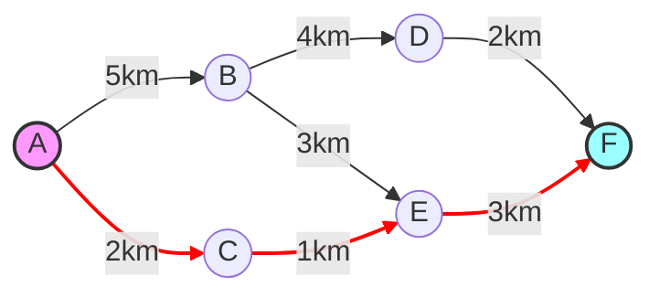

---
tags:
  - EntendendoAlgoritmos
---

## 1. O que é e para que serve?
O algoritmo de Dijkstra, criado pelo cientista da computação Edsger Dijkstra em 1956, resolve um problema comum em nosso dia a dia: encontrar o caminho mais curto entre dois pontos em uma rede levando em conta o peso da rota. 

Imagine que você está usando um GPS para encontrar a rota mais rápida até seu destino - é muito provável que ele use uma variação deste algoritmo!

## 2. Contexto Prático
Pense nas seguintes situações onde o algoritmo é útil:
- Navegação GPS: encontrar a rota mais rápida ou mais curta
- Redes de computadores: determinar o melhor caminho para transmitir dados
- Logística: otimizar rotas de entrega

## 3. Como Funciona?

### Conceitos Básicos
- **Vértices**: São os pontos da rede (cidades, roteadores, etc.)
- **Arestas**: São as conexões entre os pontos (estradas, cabos, etc.)
- **Pesos**: São os custos de cada conexão (distância, tempo, etc.)

### O Processo Passo a Passo

1. **Preparação Inicial**
   - Marque o ponto de partida com distância 0
   - Marque todos os outros pontos com distância "infinita"
   - Crie uma lista de pontos a visitar

2. **Processo Principal**
   - Escolha o ponto mais próximo ainda não visitado
   - Verifique todos os caminhos que saem dele
   - Atualize as distâncias se encontrar caminhos mais curtos
   - Marque o ponto como visitado

3. **Finalização**
   - Continue até visitar todos os pontos alcançáveis
   - O resultado será o menor caminho até cada ponto

## 4. Exemplo Visual

Vamos resolver um problema real:

### Resolução Passo a Passo:
1. Começamos em A (0km)
2. Opções imediatas:
   - Para B: 5km
   - Para C: 2km ✓ (escolhemos este por ser menor)
3. A partir de C:
   - Para E: 2km + 1km = 3km
4. E assim por diante...

## 5. Dicas Importantes
- O algoritmo só funciona com pesos positivos
- É mais eficiente usar uma fila de prioridade para escolher o próximo ponto
- Sempre mantém um registro do melhor caminho encontrado até o momento

## 6. Aplicações Práticas Modernas
- Waze e Google Maps
- Roteamento de pacotes na internet
- Planejamento de rotas em jogos

## 7. Eficiência
A velocidade do algoritmo depende da implementação:
- Com lista simples: mais lento, mas mais fácil de implementar
- Com fila de prioridade: mais rápido, ideal para sistemas reais

## 8. Pontos Fortes e Limitações

### Pontos Fortes
✓ Sempre encontra o melhor caminho
✓ Relativamente simples de entender
✓ Muito eficiente para redes pequenas e médias

### Limitações
✗ Não funciona com pesos negativos. Nesse caso, seria necessário utilizar o algoritmo de Bellman-Ford.
✗ Pode ser lento em redes muito grandes
✗ Consome mais memória conforme a rede cresce