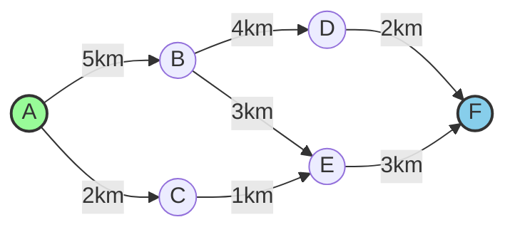

---
tags:
  - EntendendoAlgoritmos
---
---
# 1. Praticando
```python
from collections import defaultdict
import heapq

class DijkstraAlgorithm:
   def __init__(self):
       # Tabela do grafo: armazena os vizinhos e pesos
       self.graph = defaultdict(dict)
       # Conjunto para manter todos os vértices
       self.vertices = set()
       
   def add_edge(self, source, target, weight):
       """Adiciona uma aresta ao grafo com seu respectivo peso."""
       self.graph[source][target] = weight
       # Adiciona ambos os vértices ao conjunto de vértices
       self.vertices.add(source)
       self.vertices.add(target)
       
   def find_shortest_path(self, start, end):
       """Encontra o menor caminho entre start e end usando Dijkstra."""
       # Verifica se os vértices existem no grafo
       if start not in self.vertices or end not in self.vertices:
           return [], float('infinity')
       
       # Tabela de custos: menor distância conhecida para cada vértice
       costs = {vertex: float('infinity') for vertex in self.vertices}
       costs[start] = 0
       
       # Tabela de pais: armazena o caminho
       parents = {vertex: None for vertex in self.vertices}
       
       # Fila de prioridade para processar vértices
       # Cada elemento é uma tupla (custo, vértice)
       pq = [(0, start)]
       
       # Conjunto para rastrear vértices visitados
       processed = set()
       
       while pq:
           # Pega o vértice com menor custo ainda não processado
           current_cost, current_vertex = heapq.heappop(pq)
           
           # Se já processamos este vértice, continue
           if current_vertex in processed:
               continue
               
           # Marca como processado
           processed.add(current_vertex)
           
           # Se chegamos ao destino, podemos parar
           if current_vertex == end:
               break
               
           # Verifica todos os vizinhos do vértice atual
           for neighbor, weight in self.graph[current_vertex].items():
               if neighbor in processed:
                   continue
                   
               # Calcula novo custo para chegar ao vizinho
               new_cost = current_cost + weight
               
               # Se encontramos um caminho mais curto, atualize
               if new_cost < costs[neighbor]:
                   costs[neighbor] = new_cost
                   parents[neighbor] = current_vertex
                   heapq.heappush(pq, (new_cost, neighbor))
       
       # Reconstrói o caminho do fim até o início
       path = []
       current = end
       
       # Se não há caminho até o destino, retorna lista vazia
       if costs[end] == float('infinity'):
           return [], float('infinity')
           
       # Reconstrói o caminho
       while current is not None:
           path.append(current)
           current = parents[current]
       
       # Reverte o caminho para ter a ordem correta
       path.reverse()
       
       return path, costs[end]

# Exemplo de uso
if __name__ == "__main__":
   # Criar instância do algoritmo
   dijkstra = DijkstraAlgorithm()
   
   # Adicionar as arestas do exemplo
   dijkstra.add_edge('A', 'B', 5)
   dijkstra.add_edge('A', 'C', 2)
   dijkstra.add_edge('B', 'D', 4)
   dijkstra.add_edge('B', 'E', 3)
   dijkstra.add_edge('C', 'E', 1)
   dijkstra.add_edge('D', 'F', 2)
   dijkstra.add_edge('E', 'F', 3)
   
   # Encontrar o menor caminho de A até F
   path, cost = dijkstra.find_shortest_path('A', 'F')
   
   # Mostrar resultados
   if cost == float('infinity'):
       print("Não existe caminho entre os pontos especificados")
   else:
       print(f"Menor caminho: {' -> '.join(path)}")
       print(f"Custo total: {cost}km")

# Teste com diferentes caminhos
print("\nTestando diferentes caminhos:")
inicio_fim = [('A', 'F'), ('A', 'E'), ('B', 'F'), ('C', 'D')]
for inicio, fim in inicio_fim:
   path, cost = dijkstra.find_shortest_path(inicio, fim)
   if cost == float('infinity'):
       print(f"\nDe {inicio} para {fim}: Não existe caminho")
   else:
       print(f"\nDe {inicio} para {fim}:")
       print(f"Caminho: {' -> '.join(path)}")
       print(f"Custo: {cost}km")
```

# 2. Como Funciona? 🤔
### A Ideia Básica
Imagine que você está em uma cidade (vamos chamar de ponto A) e quer chegar a outra cidade (ponto F). Entre essas cidades, existem várias rotas possíveis, cada uma com uma distância diferente. O algoritmo funciona assim:

1. Primeiro, ele marca a distância até todas as cidades como "infinito", exceto a cidade inicial (que é zero)
2. Então, ele olha para todas as cidades vizinhas da cidade atual
3. Para cada vizinho, calcula se encontrou um caminho mais curto
4. Repete o processo até chegar ao destino

### Visualizando o Processo


# 3. Estruturas de Dados Principais 📊

### 1. O Mapa (Grafo)
```python
self.graph = defaultdict(dict)
```
É como uma tabela que guarda todas as conexões entre as cidades:
- Para cada cidade, guardamos suas vizinhas e as distâncias
- Exemplo: A pode ir para B (5km) e C (2km)

### 2. Lista de Cidades (Vértices)
```python
self.vertices = set()
```
- Uma lista de todas as cidades no nosso mapa
- Cada cidade é adicionada automaticamente quando criamos uma conexão

# 4. O Passo a Passo do Algoritmo 🚶

### 1. Preparação
```python
costs = {vertex: float('infinity') for vertex in self.vertices}
costs[start] = 0
parents = {vertex: None for vertex in self.vertices}
```
- Começamos marcando todas as distâncias como infinito
- A cidade inicial recebe distância 0
- Criamos uma lista para lembrar o caminho que fizemos

### 2. Explorando o Mapa
Vamos ver como o algoritmo explora o mapa do exemplo acima:

#### Passo 1: Saindo de A
- A → B = 5km
- A → C = 2km
- Escolhe C por ser mais próximo

#### Passo 2: Explorando a partir de C
- C → E = 3km total (2km até C + 1km até E)
- Muito melhor que ir por B! (que seria 8km)

#### Passo 3: Chegando em F
- E → F = 6km total (3km até E + 3km até F)
- Melhor que ir por B→D→F (que seria 11km)

## Como Usar o Código 💻

### Exemplo Básico
```python
# Criar nosso "GPS"
dijkstra = DijkstraAlgorithm()

# Adicionar as rotas
dijkstra.add_edge('A', 'B', 5)  # De A para B, 5km
dijkstra.add_edge('A', 'C', 2)  # De A para C, 2km
# ... adicionar outras rotas ...

# Encontrar o menor caminho
caminho, distancia = dijkstra.find_shortest_path('A', 'F')
```

### O Que Você Recebe
```python
# Se pedirmos o caminho de A até F:
print(f"Caminho: {' -> '.join(caminho)}")  # Saída: A -> C -> E -> F
print(f"Distância total: {distancia}km")   # Saída: 6km
```

## Dicas e Observações 💡

### Pontos Importantes
1. O algoritmo sempre encontra o menor caminho possível
2. Funciona apenas com distâncias positivas
3. Pode ser usado para outros tipos de "distância" (tempo, custo, etc.)

### Casos de Uso
- Navegação GPS
- Roteamento de rede
- Planejamento de logística
- Qualquer problema onde você precisa encontrar o caminho mais eficiente

## Possíveis Melhorias 🚀
1. Adicionar suporte para rotas de mão dupla
2. Guardar caminhos populares na memória
3. Adicionar visualização do progresso
4. Calcular rotas alternativas

## Conclusão
O algoritmo de Dijkstra é uma ferramenta poderosa para encontrar o melhor caminho entre dois pontos. Apesar de parecer complexo inicialmente, ele segue uma lógica simples: sempre escolher o caminho mais curto disponível até chegar ao destino.