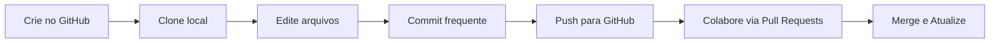

---
## 01 Seu Primeiro Repositório no GitHub

Criando seu primeiro repositório na nuvem.

1. Acesse [github.com](https://github.com) e clique em + > New repository
2. Nomeie o repositório (ex: `meu-primeiro-site`)
3. Marque "Add a README file"
4. Clique em "Create repository"

É como criar uma pasta de projetos online que sempre estará segura!

## 02 Trazer o Projeto para Seu Computador

Faça uma cópia local (clone):
```bash
git clone https://github.com/seu-usuario/meu-primeiro-site.git

cd meu-primeiro-site
```

O que aconteceu?
- Baixou todos os arquivos
- Criou link automático com o GitHub (chamado `origin`)
- Preparou para edição local

## 03 Trabalhando no Seu Projeto

Fluxo básico de trabalho:
- Edite os arquivos (ex: `index.html`)
- Salve as alterações
- Sempre verifique o status:
```bash
git status
```

Dica útil: Faça pequenas alterações e salve frequentemente!

## 04 Salvar Versões (Commits)

Guarde cada etapa do progresso:
```bash
git add .                         # Captura TODAS as mudanças
git commit -m "Adicionei menu"    # Cria um "salvamento" com mensagem
```

## 05 Enviar para o GitHub (Push)

Atualize a nuvem com suas mudanças:
```bash
git push origin main
```

Primeira vez?
- Abrirá janela de login do GitHub
- Use seu usuário/senha ou token de acesso

Depois do primeiro push:
```bash
git push  # Só isso! O Git lembra onde enviar
```

## 06 Trabalho em Equipe (Colaboração)

Para atualizar seu projeto com mudanças dos colegas:
```bash
git pull origin main
```

Cuidado importante:
Sempre faça `git pull` ANTES de começar a editar, especialmente em times!

## 07 Trabalhando em Funcionalidades (Branches)

Mantenha o projeto organizado:

- Crie um ambiente separado:
```bash
git checkout -b nova-funcionalidade
```

- Trabalhe normalmente (commits só afetam essa branch)
```shell
git add .
git commit -m "adiciona nova funcionalidade"
```

- Ao terminar:
```bash
git push origin nova-funcionalidade
```

Fluxo seguro:
- `main`: versão estável  
- Branches: experimentos e novas features

## 08 Integrando Mudanças (Merge)

Junte seu trabalho ao projeto principal:

- No GitHub:
   - Vá em **Pull Requests** > **New Pull Request**
   - Selecione `main` (base) e sua branch (compare)
- Revise as mudanças
- Clique **Merge Pull Request**

Trabalho em equipe:
- Peça para alguém revisar antes de mergear!

## 09 Atualizando Seu Ambiente Local

Sincronize tudo após merges:
```bash
git checkout main          # Volte para a branch principal
git pull origin main       # Baixe as atualizações
git branch -d minha-branch # Apague a branch local (opcional)
```

---

## 🛠 Checklist de Boas Práticas
10. `git pull` antes de editar
11. Commits pequenos e frequentes
12. Mensagens claras nos commits
13. Branches para novas funcionalidades
14. Sempre teste antes de fazer push



## ❌ Erros Comuns (e Soluções)
**"Não consigo fazer push!"**
- Solução: `git pull` primeiro e resolva conflitos se necessário

**"Apaguei arquivo sem querer!"**
- Solução: `git checkout -- arquivo-importante.txt`

**"Commit com mensagem errada!"**
- Solução: `git commit --amend -m "Nova mensagem correta"`